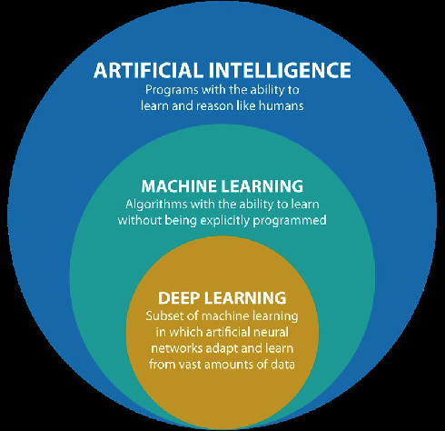
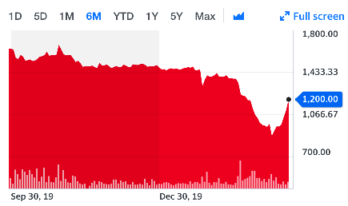
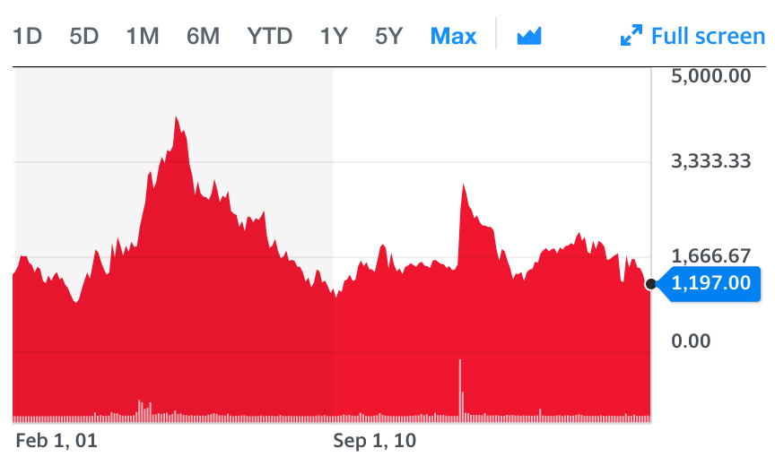

# Introduction

The COVID-19 pandemic is having a profound impact on people and societies around the globe.  As a result of that impact, the data that we record is also being affected.  This document attempts to look at various kinds of anomalous data, and also the impact of anomalies in specific instances of machine learning.

## A Few Words About COVID-19

The COVID-19 pandemic is having and will have serious consequences.  The largest is, of course, the  impact on individuals, their family and their loved ones.  The enormous strain that the pandemic places on healthcare systems results in a secondary impact to those needing care for reasons other than COVID-19, including those that suffer from acute medical conditions ranging from appendicitis to heart attacks and strokes.  Financial and economic difficulties caused by loss of work and reduction in salaries (for the fortunate) also result from this event.  While the vast majority of the impacts of the virus are negative, there are a very few benefits that the virus, and the "shelter in place" orders may have.  These positive impacts include reduced carbon emissions, fewer vehicle accidents, and the chance for families to spend some time together.

I mention the above because I want to be clear that these are all of primary concern.

Stepping back from the immediacy of these issues for a moment, there is another impact to those fields related to data.  The purpose of this document is to explore some of these impacts.

# Some Context

The COVID-19 pandemic is being captured in the form of recorded data.  We are recording losses in jobs, dropping prices in some commodities (gas), and increases in others (toilet paper and hand sanitizer).  The data that we are capturing today will be used to train descriptive and predictive models.  Will those models be valuable considering the instability in our systems?  This post will explore that questions.  First, however, it is help to begin with some context.  

The following diagram provides shows the relationship of the terms of AI, Machine Learning and Deep Learning.



Ian Goodfellow, "Deep Learning".  https://www.deeplearningbook.org/contents/intro.html Page 9.

This post will focus on data that is in the Machine Learning bubble, and for the most part supervised learning.

# Outliers

The National Institute of Standards and Technology (NIST) defines data outliers as follows:

Outliers can be subdivided into two groups:  Observational outliers and contextual outliers.  The following sections will explore some aspects of two types of outliers and include some examples.

## Abnormal Values

The most obvious outliers are abnormal values.  The National Institute of Standards and Technology defines outliers as follows:

<pre>An outlier is an observation that lies an abnormal distance from other values in a random sample from a population. In a sense, this definition leaves it up to the analyst (or a consensus process) to decide what will be considered abnormal. Before abnormal observations can be singled out, it is necessary to characterize normal observations.</pre>

Many examples of these outliers can be found in the standard analytics literature and commonly used datasets.  One such example appears in the standard R package in the mtcars dataset.  It is easy to see the outlier in this plot:

```{r}
plot(mtcars$wt, mtcars$hp, xlab="Horsepower", ylab="Weight")
```

One nice thing about these kinds of abnormal observations is that it is possible to measure the degree that a point represents an outlier.  

Cook's distance provides a metric that can be used to quantify outliers.

```{r}
mdl <- lm(wt~hp, data=mtcars)
cd <- cooks.distance(mdl)
plot(cd)
```
If you're curious, the outlier in the above dataset is a Maserati Bora that has a weight of 3,570 lbs and 335 gross horsepower.  In other words, for it's weight, it is not powerful when compared to other cars in the sample.

## Contextual Outliers

In their book "Data Mining: Concepts and Techniques, 3rd Edition"" by Micheline Kamber, Jiawei Han, and Jian Pei, the authors provide an extended definition of outliers:

<pre>An object in a given data set is a contextual outlier (or conditional outlier) if it deviates significantly with respect to a specific context of the object...</pre>
(Section 12.7 Mining Contextual and Collective Outliers)

The key here is that the outlier is considered within a given context.  To illustrate this point, consider the following graph of the Dow Jones Industrial Average for the past 6 months:



In the above, we see a huge dip in the Dow as a result of concerns about COVID-19.  If we "zoom out" and look at the Dow since 2001, we can see that the recent anomolies in the Dow are actually, pretty minor compared to other points in time.



As displayed in the two examples above, outliers are somewhat subjective.

## Economic Shocks

Another concept to consider in this discussion, particularly in the context of COVID-19, is economic shocks.  Yahoo finance defines economic shocks as follows:  

<pre>An economic shock, also known as a macroeconomic shock, is any unexpected event that has a large-scale, unexpected impact on the economy.</pre> https://finance.yahoo.com/news/economic-shocks-definition-examples-221454349.html

So, the question arises, is an economic shock an outlier?  Based on the pure definition of an outlier, the answer is yes.  It is an unexpected event that has an effect on the economy.  Frequently, the effects of economic shocks eventually fade away.  To see an example, let's take a look historical gross domestic product (GDP) for the United States.

```{r}
gdp <- read.csv("GDP.csv", header=T)
plot(gdp, main="United States Gross Domestic Product", ylab="$B")
```

In 2008-2009, the US economy suffered through the housing crisis.  (See https://www.washingtonpost.com/business/economy/a-guide-to-the-financial-crisis--10-years-later/2018/09/10/114b76ba-af10-11e8-a20b-5f4f84429666_story.html)  The impact that crisis had on the overall GDP of the United States is clearly visible in the graph above.  It is important to note, however, that the GDP did return on it's same upward trajectory.  

Let's now think about COVID-19.  As absolutely horrible the situation is, the underlying fundamentals of our social and economic systems will largely be unaffected.  Our infrastructure will be pretty much unaffected, except for the strain on our health care system.  And, as we have seen in past epidemics and pandemics, that strain will be fairly short-lived.  Perhaps the largest impact on our economy will be in consumer confidence.  However, if we think about challenges we have seen in the past, our economic systems seem to come roaring back once the crisis is over.  That is clearly visible in the GDP plot above.  

In terms of AI and Machine Learning, do shocks prevent us from developing predictive models.  The anser is clearly no.  To illustrate this point, take a look at a model that was fitted to the GDP data above.  This is a simple second degree regression model fitted to the historical GDP data.  

```{r}
gdp <- read.csv("GDP.csv", header=T)
library(ggplot2)
gdp$idx <- seq(1,nrow(gdp))
gdp$idx2 <- gdp$idx^2
gdp_mdl <- lm(GDP~idx2, data=gdp)
gdp$pred <- predict(gdp_mdl, new_data=gdp$idx2)
p <- ggplot() +
  geom_line(data=gdp, aes(x = idx, y = GDP), color = "blue") +
  geom_line(data=gdp, aes(x = idx, y = pred), color = "red")
p

```

We can see that the model is off a bit due to the shock.  However, there clearly is predictive value in the model above.  To quantify that, we can see that the $R^2$ value for the model, the proportion of the variablilty explained by the model, is `r summary(gdp_mdl)$r.squared`.

# Conclusion

Shocks like the COVID-19 pandemic can have a profound impact on individuals, and a strong short term impact on society. The burden that the current situation is having on our health care system, our society, and individuals cannot be overstated.  That said, it is worthwhile to remember that the fundamentals of economic systems, including our infrastructure will be largely unaffected.  

The question that many people have is just how much of an impact will COVID-19 have on US GDP.  Some articles suggest that it could be around 7-8%, along the lines of the 2008-2009 housing crisis, including this post from March 21, 2020. 

https://www.forbes.com/sites/petercohan/2020/03/21/covid-19s-worst-case-106-jobless-rate-15-trillion-gdp-drop/#3c85130910a2pand

Other articles are less optimistic like this one from McKinnesy, but still place the impact at around that of the 2008-2009 downturn.

https://www.mckinsey.com/business-functions/risk/our-insights/covid-19-implications-for-business


We have seen large, and more prolonged impacts to our society in the past.  Despite those large, and prolonged challenges, our economic systems have been able to recover.  In terms of building analytic models that are able to accomidate outliers, that is a core competency in the discipline of analytics.  We have numerous tools to identify anomolous data, and to handle it based on the context that it arises.